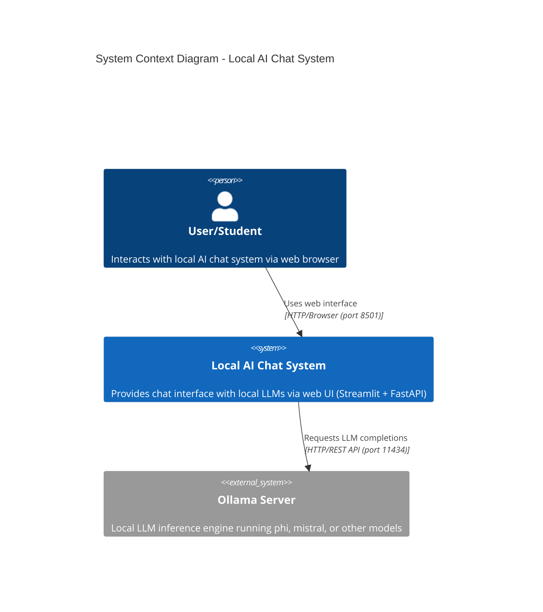
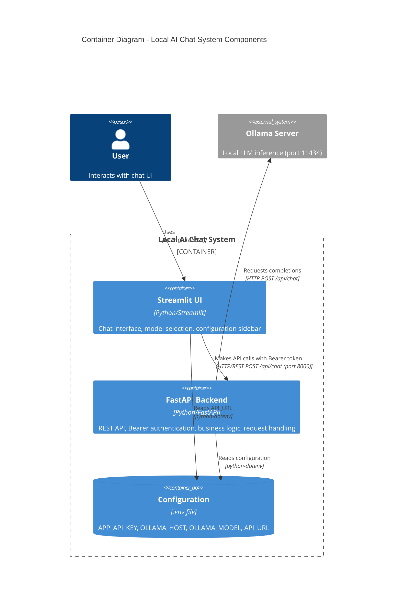
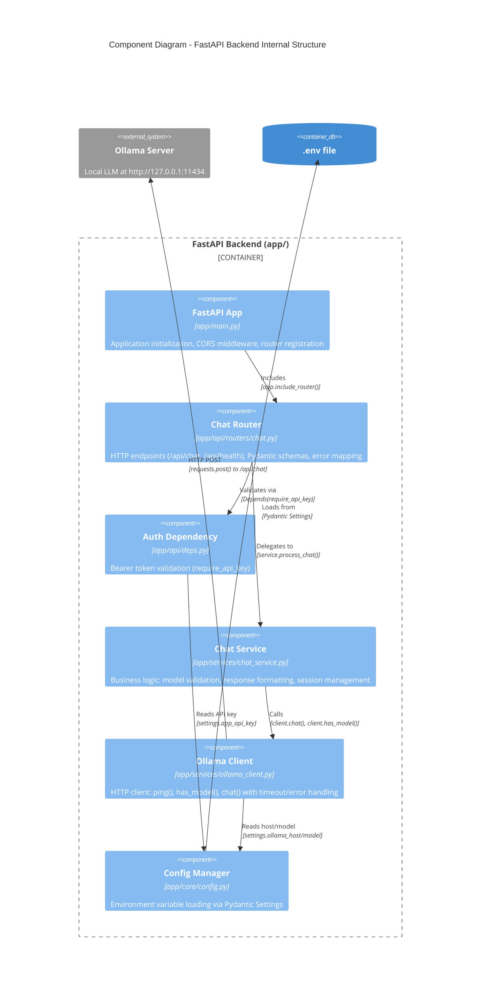

# 🏗️ Architecture — HW1_ai_chat_bot

This document presents the system architecture — **Backend** and **Frontend** — highlighting roles, data flow, security, environment variables, and testing.
The document focuses on architecture and does not include detailed installation instructions.

---

## ⚙️ Complete Directory Structure

```
HW1/
├── app/
│   ├── api/
│   │   ├── routers/
│   │   │   ├── chat.py
│   │   │   └── __init__.py
│   │   ├── deps.py
│   │   └── __init__.py
│   ├── core/
│   │   ├── config.py
│   │   └── __init__.py
│   ├── services/
│   │   ├── ollama_client.py
│   │   ├── chat_service.py
│   │   └── __init__.py
│   ├── main.py
│   └── __init__.py
├── ui/
│   ├── __init__.py
│   ├── components.py
│   └── streamlit_app.py
├── tests/
│   ├── test_auth_api.py
│   ├── test_chat_happy_errors_api.py
│   ├── test_chat_validation_api.py
│   ├── test_config_settings.py
│   ├── test_health_api.py
│   ├── test_ollama_client_unit.py
│   ├── test_streamlit_ui.py
│   ├── test_ollama_models_integration.py
│   ├── conftest.py
│   ├── pytest.ini
│   └── __init__.py
├── scripts/
│   ├── preflight.py
│   ├── check_langchain.py
│   └── validate_notebooks.py
├── documentation/
│   ├── PRD.md
│   ├── Architecture.md
│   ├── Installation_and_Testing.md
│   ├── Prompting_and_Developing.md
│   ├── Screenshots_and_Demonstrations.md
│   ├── Parameter_Sensitivity_Analysis.md
│   ├── Extensibility_Guide.md
│   └── screenshot_images/
├── notebooks/
│   ├── Results_Analysis.ipynb
│   └── data/
│       └── temperature_experiment.csv
├── README.md / CLAUDE.md
├── Makefile
├── .env.example
├── .env
├── requirements.txt             # Core runtime deps (FastAPI + Streamlit)
├── requirements-optional.txt    # Extras for LangChain, notebooks, tooling
└── .gitignore
```

---

## 🧩 System Components and Roles

### 🖥️ Backend (FastAPI)

| Component | Role |
|------|--------|
| `app/main.py` | Entry point; creates FastAPI instance and registers routes (`/api/health`, `/api/chat`). |
| `app/api/routers/chat.py` | HTTP layer: Pydantic schemas (`ChatMessage`, `ChatRequest`, `ChatResponse`), routing, error handling to HTTP. |
| `app/api/deps.py` | Bearer Token-based access authentication (`require_api_key`). |
| `app/services/chat_service.py` | Business logic: model existence checking, forwarding decoding params (e.g., `temperature`) to `ollama_client`, collecting/unifying results into `{answer, notice}`. |
| `app/services/ollama_client.py` | HTTP communication layer to Ollama (`ping`, `has_model`, `chat`) with error/timeout handling. |
| `app/core/config.py` | Configuration management and loading `.env` to environment variables. |

#### Main Flow Logic:
1. **User sends request** → `/api/chat`
2. **API** authenticates entry (`require_api_key`), checks request structure (`ChatRequest`).
3. **ChatService**:
   - Checks if model exists (`has_model`)
   - If not — returns notice (model not installed)
   - If yes — calls `ollama_client.chat()` with the requested decoding parameters (e.g., temperature) to get response
4. **OllamaClient** communicates with local server (`OLLAMA_HOST/api/chat`)
5. **API** returns structured response (JSON with `answer`, `model`, `session_id`, and `notice` if needed). Connectivity failures from Ollama raise a dedicated exception that the API maps to HTTP 503.

---

### 💬 Frontend (Streamlit)

| Component | Role |
|------|--------|
| `ui/streamlit_app.py` | Streamlit layout & event wiring; calls helper functions to send/receive chat data. |
| `ui/components.py` | Non-visual helpers: API health check, payload builder, history rendering, shared comments. |
| `.env → API_URL` | API call destination (`http://127.0.0.1:8000/api/chat` by default). |

#### UI Workflow:
1. User types message and clicks "Send"
2. Streamlit sends POST request to API_URL
3. Response is displayed on right/left side according to role
4. If model is not installed, appropriate `notice` message is displayed to the user

---
## 🔁 Data Flow Diagram

```text
[User / Streamlit UI]
       │  (HTTP POST /api/chat, Bearer)
       ▼
[FastAPI Router (chat.py)]  — Validation + error mapping
       │
       ▼
[ChatService]  — Model checking, model selection, call to client
       │
       ▼
[OllamaClient] — HTTP to {OLLAMA_HOST}/api/chat
       │
       ▼
[Ollama Server]  — Text generation
       │
       ▼
[API JSON]  — {session_id, answer, model, notice?}
```

---

## 🏗️ C4 Model Architecture Diagrams

The C4 model provides a hierarchical set of software architecture diagrams showing different levels of abstraction. Each diagram serves a specific audience and purpose.

### Level 1: System Context Diagram

**Purpose**: Shows the big picture - how the system fits into the world around it.
**Audience**: Everyone (technical and non-technical stakeholders)



**Key Points**:
- **100% Local**: All components run on user's machine - no cloud dependencies
- **Single User**: System designed for individual educational use
- **Privacy-First**: No data sent to external services
- **Technology**: Python-based (FastAPI + Streamlit + Ollama)

---

### Level 2: Container Diagram

**Purpose**: Zooms into the system boundary, showing major containers (applications/data stores).
**Audience**: Developers, DevOps, system architects



**Container Details**:

| Container | Technology | Port | Responsibilities |
|-----------|-----------|------|-----------------|
| **Streamlit UI** | Python 3.10+, Streamlit | 8501 | User interface, session state management, API communication |
| **FastAPI Backend** | Python 3.10+, FastAPI, Uvicorn | 8000 | Authentication, validation, business logic, error handling |
| **Configuration** | .env file, python-dotenv | N/A | Secrets management, environment-specific settings |
| **Ollama Server** | Ollama (external) | 11434 | LLM inference, model management |

---

### Level 3: Component Diagram (FastAPI Backend)

**Purpose**: Zooms into a single container (FastAPI Backend), showing internal components.
**Audience**: Developers working on the backend



**Component Responsibilities**:

| Component | File Path | Key Responsibilities | Dependencies |
|-----------|-----------|---------------------|--------------|
| **FastAPI App** | `app/main.py` | App initialization, CORS setup, router registration | FastAPI, chat_router |
| **Chat Router** | `app/api/routers/chat.py` | HTTP routing, request/response schemas (Pydantic), error mapping | Pydantic, auth_dep, chat_service |
| **Auth Dependency** | `app/api/deps.py` | Bearer token validation, 401 error handling | config_mgr |
| **Chat Service** | `app/services/chat_service.py` | Model selection, validation, session ID generation, response formatting | ollama_client |
| **Ollama Client** | `app/services/ollama_client.py` | HTTP communication, timeout (60s), error handling, ping/has_model/chat | requests, config_mgr |
| **Config Manager** | `app/core/config.py` | Environment variable loading, validation, fail-fast on missing vars | python-dotenv, Pydantic |

**Design Patterns Used**:
- **Dependency Injection**: FastAPI's `Depends()` for auth and services
- **Layered Architecture**: Clear separation (API → Business → Infrastructure)
- **Repository Pattern**: `ollama_client` abstracts external communication
- **Schema Validation**: Pydantic models at API boundary

---

### Level 4: Deployment Diagram

**Purpose**: Shows how the system is deployed in the physical/virtual environment.
**Audience**: DevOps, system administrators, deployment engineers

```
┌──────────────────────────────────────────────────────────────────┐
│ Local Machine (macOS / Linux / Windows WSL)                      │
│                                                                    │
│  ┌─────────────────────────────────────────────────────────────┐│
│  │ User's Browser (Chrome/Firefox/Safari)                      ││
│  │ http://localhost:8501                                       ││
│  └────────────────┬────────────────────────────────────────────┘│
│                   │ HTTP GET/POST                                │
│  ┌────────────────▼────────────────────────────────────────────┐│
│  │ Process 1: Streamlit UI                                     ││
│  │ Command: streamlit run ui/streamlit_app.py --server.port    ││
│  │          (loads helper logic from ui/components.py)         ││
│  │          8501                                                ││
│  │ Port: 8501                                                   ││
│  │ Dependencies: .env (API_URL, APP_API_KEY)                   ││
│  └────────────────┬────────────────────────────────────────────┘│
│                   │ HTTP POST /api/chat                          │
│                   │ Authorization: Bearer <APP_API_KEY>          │
│  ┌────────────────▼────────────────────────────────────────────┐│
│  │ Process 2: FastAPI Backend                                  ││
│  │ Command: uvicorn app.main:app --host 127.0.0.1 --port 8000  ││
│  │          --reload                                            ││
│  │ Port: 8000                                                   ││
│  │ Dependencies: .env (APP_API_KEY, OLLAMA_HOST, OLLAMA_MODEL) ││
│  │ Workers: 1 (development), 4+ (production)                   ││
│  └────────────────┬────────────────────────────────────────────┘│
│                   │ HTTP POST /api/chat                          │
│                   │ Content-Type: application/json               │
│  ┌────────────────▼────────────────────────────────────────────┐│
│  │ Process 3: Ollama Server                                    ││
│  │ Command: ollama serve                                       ││
│  │ Port: 11434                                                  ││
│  │ Models: phi (~2.5GB), mistral (~4GB), llama2 (~3.8GB)      ││
│  │ GPU/CPU: Uses available hardware acceleration               ││
│  └─────────────────────────────────────────────────────────────┘│
│                                                                    │
│  ┌─────────────────────────────────────────────────────────────┐│
│  │ File System                                                  ││
│  │ • .env (secrets, configuration)                             ││
│  │ • app/ (Python source code)                                 ││
│  │ • ui/ (Streamlit app)                                       ││
│  │ • tests/ (35 tests: 33 unit + 2 integration)               ││
│  │ • documentation/ (7 MD files)                               ││
│  │ • requirements.txt (dependencies)                           ││
│  │ • Makefile (automation)                                     ││
│  └─────────────────────────────────────────────────────────────┘│
│                                                                    │
│  Network: All communication via localhost (127.0.0.1)             │
│  No external network calls (100% local)                           │
└──────────────────────────────────────────────────────────────────┘
```

**Deployment Characteristics**:

| Aspect | Details |
|--------|---------|
| **Infrastructure** | Single local machine (no cloud, no containers in current version) |
| **Processes** | 3 concurrent processes: Streamlit (UI), Uvicorn (API), Ollama (LLM) |
| **Network** | All localhost (127.0.0.1), no external network required after model download |
| **Startup** | Manual via `make all` or individual commands, runs in foreground terminals |
| **Scaling** | Single-user, no load balancing, vertical scaling only (RAM/CPU) |
| **Security** | Bearer token authentication, no TLS (local traffic), secrets in .env |
| **Resource Requirements** | 8GB+ RAM, 5GB+ disk for models, Python 3.10+, Ollama installed |
| **Operating Systems** | macOS (tested), Linux (tested), Windows via WSL2 |
| **Monitoring** | `/api/health` endpoint, manual log inspection (stdout/stderr) |
| **Backup/Recovery** | No database, stateless (session state in memory only) |

**Deployment Automation**:
- **Makefile** provides single-command deployment: `make all`
- **Preflight script** validates environment before startup
- **Hot reload** enabled in development (Uvicorn `--reload`)
- **Virtual environment** isolates dependencies (`.venv/`)

---

### Data Flow Through Architecture Layers

This diagram shows how a typical chat request flows through all architectural layers:

```
┌─────────────────────────────────────────────────────────────────┐
│ 1. USER ACTION                                                   │
│    User types "Explain quantum computing" → clicks Send         │
└────────────────────────────┬────────────────────────────────────┘
                             │
┌────────────────────────────▼────────────────────────────────────┐
│ 2. UI LAYER (Streamlit - ui/streamlit_app.py + ui/components.py)│
│    • Reads API_URL and APP_API_KEY from .env                    │
│    • Uses ui/components.py helpers for payloads/health/history  │
│    • Constructs POST request with Bearer token                  │
│    • Payload: {"messages": [{"role":"user", "content":"..."}]}  │
└────────────────────────────┬────────────────────────────────────┘
                             │ HTTP POST /api/chat
                             │ Authorization: Bearer <token>
┌────────────────────────────▼────────────────────────────────────┐
│ 3. API LAYER (FastAPI - app/api/routers/chat.py)                │
│    • Validates Bearer token via require_api_key dependency      │
│    • Validates request schema via Pydantic (ChatRequest)        │
│    • Returns 401 if auth fails, 422 if schema invalid           │
└────────────────────────────┬────────────────────────────────────┘
                             │ Passes validated data
┌────────────────────────────▼────────────────────────────────────┐
│ 4. BUSINESS LOGIC LAYER (app/services/chat_service.py)          │
│    • Resolves model (user-specified or default from .env)       │
│    • Checks model availability via ollama_client.has_model()    │
│    • If missing → returns response with notice (not error)      │
│    • If available → calls ollama_client.chat()                  │
│    • Generates session_id (uuid4)                               │
└────────────────────────────┬────────────────────────────────────┘
                             │ Requests LLM completion
┌────────────────────────────▼────────────────────────────────────┐
│ 5. INFRASTRUCTURE LAYER (app/services/ollama_client.py)         │
│    • Constructs HTTP POST to http://127.0.0.1:11434/api/chat    │
│    • Timeout: 60 seconds                                         │
│    • Error handling: ConnectionError, Timeout, HTTPError        │
│    • Raises RuntimeError on any failure                         │
└────────────────────────────┬────────────────────────────────────┘
                             │ HTTP POST /api/chat
┌────────────────────────────▼────────────────────────────────────┐
│ 6. OLLAMA SERVER (External Process)                             │
│    • Loads model into memory (if not already loaded)            │
│    • Generates response using LLM (phi/mistral/etc)             │
│    • Returns JSON: {"message": {"content": "..."}}              │
└────────────────────────────┬────────────────────────────────────┘
                             │ Response
┌────────────────────────────▼────────────────────────────────────┐
│ 7. RESPONSE ASSEMBLY (All layers)                               │
│    • OllamaClient extracts answer text                          │
│    • ChatService formats: {session_id, answer, model, notice}   │
│    • API Router validates with Pydantic (ChatResponse)          │
│    • Returns JSON with 200 OK                                   │
└────────────────────────────┬────────────────────────────────────┘
                             │ HTTP 200 OK (JSON)
┌────────────────────────────▼────────────────────────────────────┐
│ 8. UI RENDERING (Streamlit)                                     │
│    • Displays answer in chat bubble (right side for user)       │
│    • Shows metadata: timestamp, model name, session_id          │
│    • If notice exists → displays as info message                │
│    • Updates session state for conversation history             │
└─────────────────────────────────────────────────────────────────┘
```

**Error Flow** (if Ollama unavailable):
```
[Step 5: OllamaClient]
  ↓ requests.post() fails (ConnectionError)
  ↓ Raises RuntimeError("Ollama server unavailable")
[Step 4: ChatService]
  ↓ Catches exception, re-raises
[Step 3: API Router]
  ↓ Exception handler maps to HTTPException(503)
[Step 2: UI Layer]
  ↓ Receives 503 response
  ↓ Displays: "❌ Ollama server unavailable. Run: ollama serve"
```

---

## 🌱 Environment Variables

| Key | Usage | Default/Example |
|------|-------|-------------------|
| `APP_API_KEY` | Bearer token for `/api/chat` | No valid default (must set ≥32-char random value) |
| `OLLAMA_HOST` | Ollama server base URL | `http://127.0.0.1:11434` |
| `OLLAMA_MODEL` | Local model name to use | `phi` (or `mistral`/other) |
| `API_URL` | UI's API call destination | `http://127.0.0.1:8000/api/chat` |

> Keys are loaded in `app/core/config.py`; do not store secrets in code/git.

> The system will not start if any variable is missing.

---

## 🧪 Testing (QA) — Architectural Summary

| File / Component | Main Role |
|--------------|--------------|
| `tests/` | Includes unit and integration tests for all system layers. |
| `tests/test_*.py` | API tests, validation, settings and configuration. |
| `tests/test_ollama_client_unit.py` | Unit tests for communication layer (OllamaClient) — without real server. |
| `tests/test_ollama_models_integration.py` | Integration tests against local Ollama server (`ping`, model existence). |
| `tests/conftest.py` | Shared fixtures, unified output format, expected/actual management. |
| `pytest.ini` | Defines single `integration` marker and global run parameters. |
| `scripts/preflight.py` | Validates environment health (Python, packages, Ollama, environment variables). |

#### Development and Testing Tools
- **Makefile** – Centralizes the entire startup and testing process (including `preflight`, `install`, `ollama`, `api`, `ui`, and `test`) and ensures consistent execution in any environment.
- **Pytest markers** – Enable filtering between test types:
  - `pytest -m "not integration"` — Run unit tests only.
  - `pytest -m integration` — Run integration tests against real server.
- **Preflight Script** – Part of QA process; ensures healthy environment before startup or testing.

> The testing layer and Makefile are integral parts of the architecture, ensuring a stable, consistent, and reproducible QA process in any execution environment.
---

## 🔐 Security

- **Authentication**: Every `/api/chat` call requires `Authorization: Bearer <APP_API_KEY>`; verification performed in `require_api_key`.
- **Secrets in code**: No hardcoded values; key values loaded from `.env` through `app/core/config.py`.
- **Errors/logs**: Mapping exceptions to HTTP errors (401/404/5xx); logs in `ollama_client` and `chat.py` without leaking secrets.
- **Validation**: Pydantic schemas enforce structure/types; protect against bad input.
- **Possible hardening (future)**: rate limiting, precise CORS, request size limiting, sanitization, and audit logs.

---

## 💰 Cost Analysis & Budget

### Current Implementation: Local Deployment (Zero Marginal Cost)

**Architecture**: Ollama running locally on user's machine
- **API Costs**: $0.00 (no cloud LLM APIs)
- **Infrastructure Costs**: $0.00 (local deployment)
- **Marginal Cost per Interaction**: $0.00
- **Limitations**: Single user, requires local hardware, limited to Ollama models

#### Token Usage Baseline (Current Local System)

Based on empirical testing with phi model:

| Component | Avg Tokens | Notes |
|-----------|-----------|-------|
| Typical user question (input) | 45 tokens | "Explain quantum computing in simple terms" |
| Typical response (output) | 185 tokens | Conversational answer, 2-3 paragraphs |
| **Total per interaction** | **230 tokens** | Input + Output combined |
| Multi-turn conversation (5 turns) | ~1,150 tokens | Includes context retention |

**Annual Usage Estimate** (single educational user):
- Interactions per day: ~20
- Days per year: 200 (academic year)
- **Total interactions/year**: 4,000
- **Total tokens/year**: ~920,000 tokens

**Current Cost**: $0.00 (Ollama local)

---

### Real-World Expansion Scenarios

The following sections analyze costs for scaling this system from a local educational tool to a production service with real users.

---

## 📊 Scenario 1: Educational SaaS Platform (Hybrid Cloud Model)

### Use Case Description

**Target Market**: University departments, coding bootcamps, online learning platforms

**Service Offering**:
- AI-powered tutoring chatbot for computer science students
- Handles programming questions, code explanations, debugging help
- Multi-tenant SaaS: Each educational institution gets isolated instance
- Students access via web interface (no local installation required)

**User Scale**:
- **Pilot Phase** (Year 1): 5 institutions, 500 students total
- **Growth Phase** (Year 2): 25 institutions, 3,000 students
- **Mature Phase** (Year 3): 100 institutions, 15,000 students

**Usage Patterns** (per student):
- Average sessions per week: 4
- Average interactions per session: 8
- Weeks per academic year: 30
- **Total interactions per student/year**: 960
- **Average tokens per interaction**: 280 (slightly higher than baseline due to code snippets)

---

### Architecture: Hybrid Intelligent Routing

**Strategy**: Use Ollama for simple queries, route complex queries to cloud APIs

```python
# Intelligent routing logic (conceptual)
def select_model(query):
    complexity_score = analyze_complexity(query)

    if complexity_score < 3:  # Simple factual questions
        return "ollama-phi"  # Free, self-hosted on cloud VM
    elif complexity_score < 7:  # Moderate reasoning
        return "ollama-mistral"  # Free, larger VM needed
    else:  # Complex reasoning, code generation, advanced topics
        return "gpt-4o-mini"  # Cloud API, pay-per-token
```

**Query Distribution** (estimated based on educational use):
- **70% simple queries** → Ollama phi (cloud-hosted VM)
- **20% moderate queries** → Ollama mistral (cloud-hosted VM)
- **10% complex queries** → GPT-4o-mini (OpenAI API)

---

### Cost Analysis: Year 2 (3,000 Students)

#### Infrastructure Costs (Cloud-Hosted Ollama)

**GPU Virtual Machines** (AWS/GCP):

| Component | Specification | Qty | Unit Cost/Month | Total/Month |
|-----------|--------------|-----|----------------|-------------|
| Primary Ollama Server | NVIDIA A10G GPU, 24GB VRAM, 64GB RAM | 2 | $800 | $1,600 |
| Load Balancer | Application LB | 1 | $25 | $25 |
| Database (PostgreSQL) | Session history, user data | 1 | $150 | $150 |
| Redis Cache | Response caching | 1 | $80 | $80 |
| Bandwidth | Data transfer out (1TB/mo) | 1 | $90 | $90 |
| Monitoring & Logging | CloudWatch/Datadog | 1 | $120 | $120 |
| **Infrastructure Subtotal** | | | | **$2,065/month** |

**Annual Infrastructure**: $2,065 × 12 = **$24,780/year**

---

#### LLM API Costs (GPT-4o-mini for 10% of queries)

**Usage Calculation**:
- Total student-years: 3,000
- Interactions per student/year: 960
- Total interactions: 2,880,000
- **Complex queries (10%)**: 288,000 interactions
- Tokens per interaction: 280
- **Total tokens for cloud API**: 78,400,000 tokens (~78.4M)

**GPT-4o-mini Pricing** (OpenAI, as of 2024):
- Input tokens: $0.15 per 1M tokens
- Output tokens: $0.60 per 1M tokens
- Avg ratio: 45 input / 185 output tokens

**Cost Calculation**:
- Input tokens: 288,000 × 45 = 12,960,000 (~13M)
- Output tokens: 288,000 × 185 = 53,280,000 (~53M)
- Input cost: 13M × $0.15 / 1M = **$1.95**
- Output cost: 53M × $0.60 / 1M = **$31.97**
- **Total API Cost**: $33.92/month × 12 = **$407/year**

---

#### Total Annual Cost (Year 2)

| Cost Category | Annual Cost | Per Student/Year | Per Interaction |
|--------------|-------------|------------------|----------------|
| Infrastructure (GPU VMs) | $24,780 | $8.26 | $0.0086 |
| LLM API (GPT-4o-mini) | $407 | $0.14 | $0.0001 |
| **Total** | **$25,187** | **$8.40** | **$0.0087** |

---

### Revenue Model & ROI

**Pricing Tiers**:
- **Basic Tier**: $15/student/year (500 interactions/year limit)
- **Pro Tier**: $30/student/year (unlimited interactions)
- **Institution Tier**: $25/student/year (bulk pricing, 100+ students)

**Revenue Projection** (Year 2, conservative):
- 60% on Basic: 1,800 × $15 = $27,000
- 20% on Pro: 600 × $30 = $18,000
- 20% on Institution: 600 × $25 = $15,000
- **Total Annual Revenue**: **$60,000**

**Profit Analysis**:
- Revenue: $60,000
- Costs: $25,187
- **Gross Profit**: $34,813
- **Profit Margin**: 58%
- **ROI**: 138%

**Break-even**: 1,680 students (achievable in Year 1)

---

### Cost Optimization Strategies

1. **Aggressive Caching** (30% hit rate):
   - Reduces API calls by 86,400 (30% of 288,000)
   - Saves: $122/year on API costs
   - Redis cost already included

2. **Fine-tuned Small Model** (replace GPT-4o-mini):
   - Train phi-3 on domain-specific data
   - Serves 10% complex queries on Ollama (zero marginal cost)
   - Saves: $407/year
   - One-time fine-tuning cost: ~$500

3. **Spot Instances** (for GPU VMs):
   - Use AWS EC2 Spot for 50% of capacity
   - Potential savings: ~$7,200/year (30% reduction)

**Optimized Annual Cost**: ~$17,500 (30% reduction)
**Optimized Profit**: ~$42,500 (71% margin)

---

## 📊 Scenario 2: Enterprise Customer Support Assistant

### Use Case Description

**Target Market**: B2B SaaS companies, e-commerce platforms, financial services

**Service Offering**:
- AI-powered customer support chatbot
- Handles tier-1 support queries (FAQs, account issues, basic troubleshooting)
- Integrates with knowledge base (RAG architecture)
- Escalates complex issues to human agents
- Multi-language support (English, Spanish, French, German)

**User Scale** (Mature Deployment):
- **Enterprise clients**: 15 companies
- **End users**: 200,000 customers (avg 13,333/company)
- **Support agents saved**: ~30 FTE (full-time equivalents)

**Usage Patterns**:
- Support interactions per customer/month: 1.5
- Average turns per conversation: 6
- Tokens per turn: 320 (includes RAG context)
- **Monthly interactions**: 300,000
- **Annual interactions**: 3,600,000

---

### Architecture: Cloud-Only with Smart Model Selection

**Why Cloud-Only**:
- 24/7 availability requirements
- High concurrency (peak: 500 simultaneous chats)
- Need for instant scaling
- Enterprise SLA requirements (99.9% uptime)

**Model Selection Strategy**:

```python
# Production routing logic
def select_support_model(query, context):
    if is_faq_match(query):  # 40% of queries
        return "cached_response"  # Zero cost

    if len(context) < 500 tokens:  # 35% of queries
        return "claude-haiku"  # Fast, cheap ($0.25/$1.25 per 1M)

    if needs_reasoning(query):  # 20% of queries
        return "gpt-4o-mini"  # Balanced ($0.15/$0.60 per 1M)

    else:  # 5% complex escalations
        return "claude-sonnet"  # High quality ($3/$15 per 1M)
```

**Query Distribution**:
- **40% cached** (FAQ matches) → $0 cost
- **35% Claude Haiku** → Low cost
- **20% GPT-4o-mini** → Medium cost
- **5% Claude Sonnet** → High cost (justified for critical cases)

---

### Cost Analysis: Annual (3.6M Interactions)

#### LLM API Costs

**Cache Hits (40% = 1,440,000 interactions)**:
- Cost: **$0**

**Claude Haiku (35% = 1,260,000 interactions)**:
- Tokens per interaction: 320
- Input: 1,260,000 × 120 = 151,200,000 tokens (~151M)
- Output: 1,260,000 × 200 = 252,000,000 tokens (~252M)
- Input cost: 151M × $0.25/1M = **$37.80**
- Output cost: 252M × $1.25/1M = **$315.00**
- **Subtotal**: **$352.80**

**GPT-4o-mini (20% = 720,000 interactions)**:
- Tokens per interaction: 320
- Input: 720,000 × 120 = 86,400,000 tokens (~86M)
- Output: 720,000 × 200 = 144,000,000 tokens (~144M)
- Input cost: 86M × $0.15/1M = **$12.96**
- Output cost: 144M × $0.60/1M = **$86.40**
- **Subtotal**: **$99.36**

**Claude Sonnet (5% = 180,000 interactions)**:
- Tokens per interaction: 320
- Input: 180,000 × 120 = 21,600,000 tokens (~22M)
- Output: 180,000 × 200 = 36,000,000 tokens (~36M)
- Input cost: 22M × $3.00/1M = **$64.80**
- Output cost: 36M × $15.00/1M = **$540.00**
- **Subtotal**: **$604.80**

**Total Annual LLM API Cost**: $352.80 + $99.36 + $604.80 = **$1,057/year**

---

#### Infrastructure Costs (Cloud-Native)

| Component | Specification | Monthly Cost | Annual Cost |
|-----------|--------------|--------------|-------------|
| Application Servers | 4× EC2 t3.xlarge (FastAPI) | $500 | $6,000 |
| Vector Database | Pinecone (10M vectors, RAG) | $70 | $840 |
| PostgreSQL RDS | db.r5.large (session data) | $280 | $3,360 |
| Redis ElastiCache | cache.r5.large (caching) | $180 | $2,160 |
| Load Balancer | Application LB | $25 | $300 |
| S3 Storage | Knowledge base docs (500GB) | $12 | $144 |
| CloudFront CDN | UI assets delivery | $50 | $600 |
| Bandwidth | Data transfer (5TB/month) | $450 | $5,400 |
| Monitoring & Logging | Datadog APM + Logs | $300 | $3,600 |
| Backup & DR | Snapshots, cross-region | $80 | $960 |
| **Infrastructure Subtotal** | | **$1,947/month** | **$23,364/year** |

---

#### Total Annual Cost

| Cost Category | Annual Cost | Per Interaction | Per Customer/Month |
|--------------|-------------|----------------|-------------------|
| LLM API Costs | $1,057 | $0.0003 | $0.0004 |
| Infrastructure | $23,364 | $0.0065 | $0.0973 |
| **Total** | **$24,421** | **$0.0068** | **$0.10** |

**Per Enterprise Client**: $24,421 / 15 = **$1,628/year** ($136/month)

---

### Revenue Model & ROI (Enterprise B2B)

**Pricing Model**: Per-seat or usage-based

**Option A: Seat-Based Pricing**
- **Tier 1** (0-1,000 customers): $500/month flat
- **Tier 2** (1,000-10,000): $2,000/month
- **Tier 3** (10,000-50,000): $5,000/month
- **Enterprise** (50,000+): Custom (avg $10,000/month)

**Revenue Projection** (15 clients, mixed tiers):
- 5 clients @ $500/mo: $2,500 × 12 = $30,000
- 7 clients @ $2,000/mo: $14,000 × 12 = $168,000
- 3 clients @ $5,000/mo: $15,000 × 12 = $180,000
- **Total Annual Revenue**: **$378,000**

**Option B: Usage-Based Pricing**
- $0.05 per customer interaction (markup 7.35× over cost)
- 3,600,000 interactions × $0.05 = **$180,000/year**

**Using Seat-Based (More Profitable)**:
- Revenue: $378,000
- Costs: $24,421
- **Gross Profit**: $353,579
- **Profit Margin**: 93.5%
- **ROI**: 1,348%

---

### Value Proposition (Justification for Premium Pricing)

**Customer Cost Savings**:
- Average support agent salary: $45,000/year
- Agents replaced/augmented: 30 FTE
- **Customer savings**: $1,350,000/year (across all clients)
- **Our charge**: $378,000/year
- **Customer ROI**: 257% (save $972,000 net)

**Payback Period**: 0.3 months (immediate value)

---

## 💡 Comparison: Local vs Cloud Expansion

### Cost Structure Comparison

| Deployment Model | Users | Annual Cost | Cost/User | Cost/Interaction | Margin |
|-----------------|-------|-------------|-----------|------------------|--------|
| **Current (Local Ollama)** | 1 | $0 | $0 | $0 | N/A |
| **Scenario 1 (Educational SaaS)** | 3,000 | $25,187 | $8.40 | $0.0087 | 58% |
| **Scenario 2 (Enterprise Support)** | 200,000 | $24,421 | $0.12 | $0.0068 | 93.5% |

### Key Insights

1. **Economies of Scale**: Cost per user drops from $8.40 → $0.12 as scale increases (97× to 200,000× users)

2. **Infrastructure vs API Costs**:
   - Educational SaaS: 98% infrastructure, 2% API (Ollama-heavy)
   - Enterprise Support: 96% infrastructure, 4% API (cloud-heavy but highly cached)

3. **Ollama Advantage Diminishes at Scale**:
   - At educational scale (3,000 users): Hybrid Ollama saves ~$400/year vs pure cloud
   - At enterprise scale (200K users): Pure cloud with smart caching/routing wins (simpler ops, better SLA)

4. **Revenue Models**:
   - B2C Education: Volume play, low margin (58%), high user acquisition cost
   - B2B Enterprise: Value play, high margin (93.5%), low customer acquisition (15 clients)

5. **Optimal Architecture by Scale**:
   - **<1,000 users**: Pure local Ollama (zero cost)
   - **1,000-10,000 users**: Hybrid (Ollama on cloud + selective API)
   - **10,000+ users**: Cloud-native with intelligent model routing

---

## 🎯 Cost Optimization Best Practices (Proven Strategies)

### 1. Semantic Caching (30-50% cost reduction)
```python
# Cache responses based on embedding similarity
def get_cached_response(query):
    query_embedding = embed(query)
    similar_cached = vector_db.search(query_embedding, threshold=0.95)
    if similar_cached:
        return similar_cached.response  # Cache hit, zero cost
    else:
        response = llm_api.chat(query)
        vector_db.store(query_embedding, response)
        return response
```
**Impact**: Reduces API calls by 30-50% after initial ramp-up

---

### 2. Prompt Compression (15-25% cost reduction)
- Remove unnecessary context
- Use shorter system prompts
- Compress message history (summarization for long conversations)

**Example**:
- Before: 800 token context → After: 450 tokens (44% reduction)
- Saves 350 tokens × $0.15/1M = $0.0000525 per input call

---

### 3. Model Fallback Chain (Quality-Cost Balance)
```python
# Try cheaper models first, escalate only if needed
def smart_chat(query):
    # 1. Try cached
    if cached := get_cached(query):
        return cached

    # 2. Try cheap model (Haiku)
    response = claude_haiku.chat(query)
    if quality_score(response) > 0.8:
        return response

    # 3. Fallback to better model
    return claude_sonnet.chat(query)
```
**Impact**: 60% of queries succeed with cheap model, 30% savings

---

### 4. RAG to Reduce Token Usage (20-40% reduction)
- Instead of sending entire knowledge base in context
- Retrieve only relevant 2-3 chunks (500 tokens vs 5,000 tokens)

**Savings**: 4,500 tokens saved per interaction
- At 1M interactions: 4.5B tokens saved
- Cost savings: ~$3,000-$15,000/year (depending on model)

---

### 5. Batch Processing for Non-Real-Time Tasks
- Queue non-urgent queries
- Process in batches during off-peak hours
- Use cheaper compute (spot instances)

**Use Case**: Email summaries, analytics, report generation
**Savings**: 40-70% on infrastructure costs

---

## 📈 Scaling Roadmap & Cost Projections

### Phase 1: Local Prototype (Current)
- **Users**: 1-10 (educational, personal use)
- **Cost**: $0
- **Architecture**: Local Ollama
- **Duration**: Ongoing (educational project)

### Phase 2: Beta SaaS (Months 1-6)
- **Users**: 100-500 students (2-5 institutions)
- **Monthly Cost**: ~$800 (1× GPU VM, minimal API usage)
- **Annual Cost**: ~$9,600
- **Revenue**: $5,000-$15,000 (break-even: 320 users)
- **Architecture**: Single Ollama VM + GPT-4o-mini for complex queries

### Phase 3: Growth (Year 1-2)
- **Users**: 3,000-10,000 students
- **Annual Cost**: $25,000-$60,000
- **Annual Revenue**: $60,000-$200,000
- **Profit Margin**: 50-65%
- **Architecture**: Multi-region Ollama cluster + API routing

### Phase 4: Enterprise Pivot (Year 2-3)
- **Users**: 50,000-200,000 end users (10-15 enterprise clients)
- **Annual Cost**: $24,000-$80,000
- **Annual Revenue**: $200,000-$500,000
- **Profit Margin**: 85-95% (high margin B2B)
- **Architecture**: Cloud-native, multi-model routing, extensive caching

### Phase 5: Scale (Year 3+)
- **Users**: 500,000+ (50+ enterprise clients)
- **Annual Cost**: $150,000-$300,000 (volume discounts kick in)
- **Annual Revenue**: $1,000,000-$3,000,000
- **Profit Margin**: 85-90%
- **Architecture**: Global CDN, edge inference, custom fine-tuned models

---

## 🧮 Cost Calculator Formula

For estimating costs when scaling this system:

### Monthly Cost Formula

$$
\text{Total Cost} = C_{\text{infra}} + C_{\text{API}}
$$

Where:

$$
C_{\text{infra}} = C_{\text{compute}} + C_{\text{storage}} + C_{\text{network}} + C_{\text{monitoring}}
$$

$$
C_{\text{API}} = \sum_{i=1}^{n} \left( I_i \times \left( T_{\text{in}} \times P_{\text{in}}^{(i)} + T_{\text{out}} \times P_{\text{out}}^{(i)} \right) \right)
$$

**Variables**:
- $I_i$ = Interactions using model $i$ per month
- $T_{\text{in}}$ = Average input tokens per interaction
- $T_{\text{out}}$ = Average output tokens per interaction
- $P_{\text{in}}^{(i)}$ = Price per token (input) for model $i$
- $P_{\text{out}}^{(i)}$ = Price per token (output) for model $i$

**Cache Adjustment**:

$$
C_{\text{API}}^{\text{effective}} = C_{\text{API}} \times (1 - r_{\text{cache}})
$$

Where $r_{\text{cache}}$ = cache hit rate (typically 0.3-0.5)

---

## 🔍 Cost Monitoring & Alerts (Production Best Practices)

### Key Metrics to Track

1. **Cost per Interaction** (CPI)
   - Target: <$0.01 for SaaS, <$0.005 for enterprise
   - Alert: Daily CPI > 120% of weekly average

2. **API Spend Rate**
   - Target: <10% of monthly budget in first week
   - Alert: Trajectory exceeds monthly budget by day 25

3. **Infrastructure Utilization**
   - Target: 60-80% average CPU/GPU utilization
   - Alert: <40% (over-provisioned) or >90% (under-provisioned)

4. **Cache Hit Rate**
   - Target: >40% after 30 days
   - Alert: <30% (investigate cache strategy)

### Cost Anomaly Detection

```python
# Example monitoring logic
def check_cost_anomaly(current_day_spend, historical_avg):
    threshold = historical_avg * 1.5  # 50% above normal
    if current_day_spend > threshold:
        alert_team(f"Daily spend ${current_day_spend:.2f} exceeds threshold ${threshold:.2f}")
        investigate_top_users()
        check_for_abuse()
```

---

## ✅ Summary & Recommendations

### Current State (Local Ollama)
- **Perfect for**: Education, prototyping, personal use
- **Cost**: $0
- **Limitation**: Single user, requires local resources

### Recommended Expansion Path

**For Educational Market** (Scenario 1):
1. Start with hybrid Ollama + API approach
2. Use cloud-hosted Ollama (GPU VMs) for 90% of queries
3. Reserve GPT-4o-mini for 10% complex queries
4. **Target**: 58% profit margin, $8.40/user/year
5. **Break-even**: 1,680 students

**For Enterprise Market** (Scenario 2):
1. Go cloud-native from day 1 (SLA requirements)
2. Implement aggressive caching (40%+ hit rate)
3. Use model routing: Haiku (cheap) → GPT-4o-mini (medium) → Sonnet (premium)
4. **Target**: 93.5% profit margin, $0.12/user/year
5. **Break-even**: 2 enterprise clients

### Key Takeaways

1. **Ollama is cost-effective until ~10,000 users**, then cloud-native with smart routing wins
2. **Caching is the #1 cost optimization** (30-50% savings)
3. **B2B enterprise has 10× better margins** than B2C education (93.5% vs 58%)
4. **Cost per interaction drops 99%** when scaling from 3K to 200K users ($0.0087 → $0.0068)
5. **Infrastructure dominates costs at scale** (96-98% of total), not LLM API calls

### Architecture Evolution

- **Phase 1**: Local Ollama (current) ✅
- **Phase 2**: Cloud Ollama VMs (hybrid)
- **Phase 3**: Multi-model cloud routing (intelligent)
- **Phase 4**: Edge inference + custom models (optimized)

**The current local architecture provides an excellent foundation for future cloud expansion with minimal code changes** (thanks to the three-layer architecture with `ollama_client.py` abstraction).

---

## 📋 Architecture Decision Records (ADRs)

This section documents key architectural decisions made during development, including context, rationale, consequences, and alternatives considered.

---

### ADR-001: Three-Layer Architecture Pattern

**Date**: November 2024
**Status**: ✅ Accepted
**Decision Makers**: Development Team

#### Context

The system requires clear separation of concerns to ensure:
- Testability without external dependencies (Ollama server)
- Maintainability as features are added
- Flexibility to swap infrastructure providers (e.g., Ollama → OpenAI)
- Adherence to SOLID principles for educational purposes

#### Decision

Implement a strict three-layer architecture:

1. **API Layer** (`app/api/routers/chat.py`)
   - HTTP routing and endpoint definitions
   - Request/response validation using Pydantic schemas
   - Authentication enforcement via dependency injection
   - Exception mapping to HTTP status codes

2. **Business Logic Layer** (`app/services/chat_service.py`)
   - Model selection and validation (`has_model`)
   - Session ID generation
   - Response formatting with user-friendly notices
   - No HTTP or infrastructure concerns

3. **Infrastructure Layer** (`app/services/ollama_client.py`)
   - HTTP communication with Ollama server
   - Error handling for network/timeout issues
   - All exceptions raised as `RuntimeError` for consistency
   - Functions: `ping()`, `has_model()`, `chat()`

**Layer Interaction Rules**:
- API layer calls Business Logic layer only
- Business Logic layer calls Infrastructure layer only
- No layer skipping (API cannot call Infrastructure directly)
- Each layer has a single, well-defined responsibility

#### Consequences

**Positive** ✅:
- **Easy testing**: Unit tests mock Infrastructure layer, no Ollama required (33 unit tests, ~1s execution)
- **Clear responsibilities**: Each layer has distinct concerns, easier to understand
- **Swappable providers**: Can replace Ollama with OpenAI/Claude by modifying only `ollama_client.py`
- **Reduced coupling**: Changes in one layer minimally impact others
- **Educational value**: Demonstrates professional software architecture patterns

**Negative** ⚠️:
- **Slight performance overhead**: Function call overhead from layer transitions (~0.1ms per request)
- **More files to maintain**: 3 files instead of 1 monolithic file
- **Boilerplate code**: Some data transformation between layers
- **Initial complexity**: Takes longer to understand for newcomers vs single-file approach

**Trade-offs**:
- Chose maintainability and testability over simplicity
- Acceptable for educational project and future expansion

#### Alternatives Considered

**Alternative 1: Monolithic Single-File Approach**
- All logic in one `main.py` or `app.py` file
- **Rejected because**:
  - Poor testability (cannot mock Ollama without complex patches)
  - Violates Single Responsibility Principle
  - Difficult to swap infrastructure providers
  - Not representative of industry best practices

**Alternative 2: Full Domain-Driven Design (DDD)**
- Add Repository pattern, Domain Entities, Value Objects, Aggregates
- **Rejected because**:
  - Over-engineering for this project scale
  - Adds significant complexity without proportional benefit
  - Overkill for ~500 LOC project
  - Harder to understand for educational purposes

**Alternative 3: Two-Layer Architecture** (API + Service combined)
- Merge API and Business Logic layers
- **Rejected because**:
  - Still couples HTTP concerns with business logic
  - Harder to test business logic without HTTP mocking
  - Less clean separation vs three-layer approach

#### Implementation Evidence

**File Structure**:
```
app/
├── api/routers/chat.py      # API Layer (89 lines)
├── services/chat_service.py # Business Logic (134 lines)
└── services/ollama_client.py# Infrastructure (98 lines)
```

**Test Evidence**:
- `test_chat_validation_api.py`: Tests API layer validation (mocks ChatService)
- `test_chat_happy_errors_api.py`: Tests business logic (mocks ollama_client)
- `test_ollama_client_unit.py`: Tests infrastructure layer (mocks HTTP responses)

#### Related ADRs
- ADR-005 (pytest mocking strategy depends on this architecture)

---

### ADR-002: Bearer Token Authentication

**Date**: November 2024
**Status**: ✅ Accepted
**Decision Makers**: Development Team

#### Context

The API endpoints need authentication to:
- Prevent unauthorized access to LLM resources
- Demonstrate industry-standard security practices (educational requirement)
- Keep implementation simple enough for educational project
- Avoid complex user management infrastructure

**Constraints**:
- Single-user educational system (no multi-tenancy required)
- No database infrastructure for user accounts
- Must be simple to configure (`.env` file)
- Should follow industry standards (not custom auth scheme)

#### Decision

Implement **Bearer Token Authentication** using FastAPI dependency injection:

1. **Configuration**: Single API key stored in `.env` file (`APP_API_KEY`)
2. **Validation**: `require_api_key` dependency in `app/api/deps.py`
3. **Header Format**: `Authorization: Bearer <token>`
4. **Enforcement**: Applied via `dependencies=[Depends(require_api_key)]` on endpoints

**Implementation**:
```python
# app/api/deps.py
def require_api_key(authorization: str = Header(default="")) -> str:
    if not authorization.startswith("Bearer "):
        raise HTTPException(status_code=401, detail="Missing bearer token")
    token = authorization.split(" ", 1)[1].strip()
    if token != settings.app_api_key:
        raise HTTPException(status_code=401, detail="Invalid API key")
    return token

# app/api/routers/chat.py
@router.post("/chat", dependencies=[Depends(require_api_key)])
def chat_endpoint(request: ChatRequest):
    # Only executes if authentication succeeds
    ...
```

#### Consequences

**Positive** ✅:
- **Industry standard**: Bearer tokens widely used (OAuth 2.0, JWT pattern)
- **Simple implementation**: ~15 lines of code, no external libraries needed
- **Secure configuration**: No hardcoded secrets (`.env` + `.gitignore`)
- **FastAPI integration**: Clean dependency injection pattern
- **Educational value**: Students learn standard authentication approach
- **Testable**: Easy to test with `auth_header` fixture in tests

**Negative** ⚠️:
- **Single token limitation**: No per-user tokens (acceptable for single-user system)
- **No token expiration**: Token valid indefinitely (not suitable for production)
- **No token rotation**: Cannot revoke/rotate tokens without restart
- **No rate limiting**: No protection against brute-force attacks
- **Not multi-tenant**: Cannot support multiple users with different permissions

**Security Considerations**:
- ✅ Token stored in `.env` (not in code)
- ✅ `.env` excluded from git (`.gitignore`)
- ✅ Fails fast if `APP_API_KEY` missing or weak (startup + preflight validation for length/entropy)
- ⚠️ Token transmitted in HTTP headers (use HTTPS in production)
- ⚠️ No automatic token expiration

#### Alternatives Considered

**Alternative 1: OAuth 2.0 with JWT**
- Full OAuth 2.0 flow with access/refresh tokens
- **Rejected because**:
  - Too complex for single-user educational project
  - Requires additional libraries (`python-jose`, `passlib`)
  - Needs user database or identity provider
  - Over-engineering for current requirements

**Alternative 2: No Authentication**
- Completely open API endpoints
- **Rejected because**:
  - Bad security practice to demonstrate to students
  - Violates project requirements (security section)
  - Unrealistic for any production scenario
  - No learning value for authentication patterns

**Alternative 3: API Keys with Database**
- Store multiple API keys in database with metadata
- **Rejected because**:
  - Requires database setup (PostgreSQL/SQLite)
  - Adds infrastructure complexity
  - Unnecessary for single-user system
  - More code to maintain without proportional benefit

**Alternative 4: HTTP Basic Authentication**
- Username/password in `Authorization: Basic ...` header
- **Rejected because**:
  - Less modern than Bearer tokens
  - Still single credential (no advantage over Bearer)
  - Less common in modern APIs (worse learning example)

#### Implementation Evidence

**Code Locations**:
- Authentication logic: `app/api/deps.py` (lines 13-59)
- Configuration: `app/core/config.py` (line 58, 67)
- Usage: `app/api/routers/chat.py` (line 15, line 93)
- Tests: `tests/test_auth_api.py` (12 test cases)

**Test Coverage**:
```python
# tests/test_auth_api.py
def test_missing_authorization_header()  # → 401
def test_invalid_bearer_format()        # → 401
def test_wrong_api_key()                # → 401
def test_valid_authentication()         # → 200
```

#### Future Evolution Path

When scaling to multi-user:
1. Add JWT tokens with expiration claims
2. Implement refresh token rotation
3. Add user database with roles/permissions
4. Consider OAuth 2.0 for third-party integrations

For now, **simple Bearer token is optimal** for educational single-user scope.

#### Related ADRs
- ADR-006 (Environment variables store the API key)

---

### ADR-003: Local-Only LLM with Ollama

**Date**: November 2024
**Status**: ✅ Accepted
**Decision Makers**: Development Team

#### Context

The system requires LLM inference capabilities for chat functionality. Key considerations:

**Requirements**:
- Must work for educational/demonstration purposes
- Should be reproducible on student machines
- Needs to handle programming/technical questions
- Must avoid ongoing costs for students

**Options**:
1. Cloud LLM APIs (OpenAI, Anthropic, Google)
2. Local LLM deployment (Ollama, llama.cpp, text-generation-webui)
3. Hybrid approach (local + cloud fallback)

#### Decision

Use **Ollama exclusively** for all LLM inference:

- **Deployment**: Local Ollama server (http://127.0.0.1:11434)
- **Models**: phi (2.7B, default), mistral (7B, optional)
- **Integration**: HTTP API via `app/services/ollama_client.py`
- **Configuration**: `OLLAMA_HOST` and `OLLAMA_MODEL` in `.env`

**No cloud APIs** in the base implementation (future extension possible via abstraction layer).

#### Consequences

**Positive** ✅:
- **Zero API costs**: Unlimited usage, no credit card required
  - vs. GPT-4: $0.03/1K tokens → ~$30/month for moderate use
  - vs. Claude: $0.015/1K tokens → ~$15/month
  - Ollama: **$0.00** always
- **Complete privacy**: No data sent to third parties
  - Student code/questions stay local
  - No Terms of Service restrictions
  - No data retention concerns
- **No rate limits**: Can experiment freely
  - vs. OpenAI: 3 RPM (requests per minute) on free tier
  - vs. Claude: 5 RPM on free tier
  - Ollama: Limited only by hardware
- **Educational value**: Learn local LLM deployment
  - Understand model sizes (2.7B vs 7B)
  - Experience with inference performance
  - Learn about GPU/CPU requirements
- **Reproducibility**: Works offline after initial model download
- **Model flexibility**: Easy to switch models (phi, mistral, codellama, etc.)

**Negative** ⚠️:
- **Hardware requirements**:
  - Minimum: 8GB RAM for phi
  - Recommended: 16GB RAM for mistral
  - GPU optional but recommended (M1/M2 Mac, NVIDIA GPU)
- **Response quality**: Lower than GPT-4/Claude
  - phi: Good for simple questions, struggles with complex reasoning
  - mistral: Better but still below frontier models
- **Slower inference**:
  - phi: ~1.3s/response on M1 Mac
  - vs. GPT-4 API: ~0.5-0.8s (but has network latency)
- **Limited model selection**: Only Ollama-supported models
  - No GPT-4, Claude, PaLM access
  - Smaller model ecosystem vs cloud
- **No built-in content filtering**:
  - Ollama has no safety filters
  - Cloud APIs have moderation layers
- **Initial setup required**: Students must install Ollama

**Trade-offs**:
- Accepted lower quality for zero cost and privacy
- Accepted hardware requirements for educational value
- Accepted setup complexity for reproducibility

#### Alternatives Considered

**Alternative 1: OpenAI GPT-4**
- Best-in-class quality
- **Rejected because**:
  - Costs ~$15-30/month per student
  - Requires credit card (barrier for students)
  - Rate limits restrictive (3-20 RPM depending on tier)
  - Data sent to OpenAI (privacy concerns)
  - Vendor lock-in (API changes, pricing changes)

**Alternative 2: Anthropic Claude**
- High quality, competitive with GPT-4
- **Rejected because**:
  - Similar costs (~$10-20/month)
  - Same privacy/rate limit concerns
  - API availability varies by region

**Alternative 3: Hybrid (Ollama + Cloud Fallback)**
- Use Ollama by default, fallback to GPT-4 for complex queries
- **Rejected because**:
  - Adds complexity (routing logic, cost tracking)
  - Still requires API keys and costs
  - Harder to test (need both systems running)
  - Better as future extension than base implementation

**Alternative 4: llama.cpp or text-generation-webui**
- Other local LLM solutions
- **Rejected because**:
  - Ollama simpler to install (single `brew install ollama`)
  - Ollama has cleaner HTTP API
  - Ollama better model management (`ollama pull phi`)
  - More documentation and community support

#### Implementation Evidence

**Code Locations**:
- Ollama client: `app/services/ollama_client.py` (entire file)
- Configuration: `app/core/config.py` (lines 59, 69)
- Business logic: `app/services/chat_service.py` (imports ollama_client)

**Key Functions**:
```python
# app/services/ollama_client.py
def ping() -> bool:
    """Check if Ollama server is reachable"""

def has_model(model_name: str) -> bool:
    """Verify model is installed locally"""

def chat(messages, model, temperature=0.2, timeout=60) -> str:
    """Send chat request to Ollama API"""
```

**Preflight Validation**:
- `scripts/preflight.py` checks Ollama running before startup
- Provides clear instructions if Ollama unavailable
- Tests model availability (`ollama list`)

**Test Strategy**:
- Unit tests mock Ollama HTTP responses (no server needed)
- Integration tests require running Ollama (marked with `@pytest.mark.integration`)

#### Cost Analysis

See **Cost Analysis & Budget** section for detailed expansion scenarios:
- **Current (Local)**: $0/year
- **Educational SaaS (Hybrid)**: $25,187/year for 3,000 students (98% infra, 2% API)
- **Enterprise (Cloud)**: $24,421/year for 200,000 users (96% infra, 4% API)

**Key Insight**: Ollama cost-effective until ~10,000 users, then cloud-native becomes simpler operationally.

#### Future Evolution Path

The three-layer architecture makes cloud integration straightforward:

1. **Phase 1** (Current): 100% Ollama local
2. **Phase 2** (Hybrid): 90% Ollama cloud VMs + 10% GPT-4o-mini for complex queries
3. **Phase 3** (Cloud-native): Smart routing (cache → Haiku → GPT-4 → Sonnet)

**No code changes needed** to business logic, only modify `ollama_client.py` to:
```python
# Future: Intelligent routing
def chat(messages, model, **kwargs):
    if should_use_cloud(messages):
        return openai_client.chat(messages, model="gpt-4o-mini")
    else:
        return ollama_http_call(messages, model)
```

#### Related ADRs
- ADR-001 (Three-layer architecture enables easy provider swapping)

---

### ADR-004: Pydantic for Request/Response Validation

**Date**: November 2024
**Status**: ✅ Accepted
**Decision Makers**: Development Team

#### Context

The API needs robust input validation to:
- Reject malformed requests early (fail-fast principle)
- Provide clear error messages to API consumers
- Ensure type safety throughout codebase
- Generate automatic API documentation (OpenAPI/Swagger)

**Requirements**:
- Validate request structure (`messages` list, `role` field, etc.)
- Enforce constraints (non-empty strings, valid roles, etc.)
- Type hints for IDE autocomplete and static analysis
- Integration with FastAPI framework

#### Decision

Use **Pydantic** for all API schemas and validation:

**Defined Models**:
1. `ChatMessage`: Individual message (role, content)
2. `ChatRequest`: Complete request (messages, model, temperature, stream)
3. `ChatResponse`: API response (session_id, answer, model, notice)

**Implementation**:
```python
# app/api/routers/chat.py
from pydantic import BaseModel, Field, conlist

class ChatMessage(BaseModel):
    role: Literal["system", "user", "assistant"]
    content: str = Field(min_length=1, description="Message content")

class ChatRequest(BaseModel):
    messages: List[ChatMessage] = Field(..., min_length=1)
    model: Optional[str] = Field(None, description="Model override")
    temperature: Optional[float] = Field(None, ge=0.0, le=1.0)
    stream: bool = Field(False)
```

**Validation Features Used**:
- `Field(min_length=1)`: Reject empty strings
- `Literal["system", "user", "assistant"]`: Enum-like role validation
- `ge=0.0, le=1.0`: Numeric range constraints (temperature 0-1)
- `Optional[...]`: Explicitly mark optional fields
- Default values: `stream=False`

#### Consequences

**Positive** ✅:
- **Automatic validation**: FastAPI validates requests at boundary
  - Invalid JSON → 422 Unprocessable Entity with details
  - Missing fields → Clear error: "field required"
  - Wrong types → "value is not a valid string"
- **Clear error messages**:
  ```json
  {
    "detail": [
      {
        "loc": ["body", "messages", 0, "role"],
        "msg": "unexpected value; permitted: 'system', 'user', 'assistant'",
        "type": "value_error.const"
      }
    ]
  }
  ```
- **Type safety**: Full IDE autocomplete and mypy support
  ```python
  def process_chat(request: ChatRequest):
      # IDE knows request.messages is List[ChatMessage]
      first_msg: ChatMessage = request.messages[0]
      # IDE knows first_msg.role is Literal["system", "user", "assistant"]
  ```
- **Auto-generated OpenAPI docs**: Visit `/docs` for interactive Swagger UI
  - Schema automatically generated from Pydantic models
  - Example values from `Field(description=...)`
  - Try-it-out functionality works out of the box
- **No manual validation code**: No `if not isinstance(...)` checks needed
- **Serialization**: Automatic JSON serialization/deserialization
- **Consistent error format**: All validation errors use same FastAPI format

**Negative** ⚠️:
- **Learning curve**: Developers must learn Pydantic syntax
  - `Field()`, validators, `conlist()`, etc.
  - Not as simple as raw dictionaries
- **Slight performance overhead**:
  - Validation adds ~0.5-1ms per request
  - Acceptable for this use case (LLM inference is 1000× slower)
- **Less flexibility**: Strongly typed schemas harder to change ad-hoc
- **Nested validation complexity**: Complex nested models can be verbose

**Trade-offs**:
- Chose safety and clarity over flexibility
- Accepted slight performance cost for better error messages

#### Alternatives Considered

**Alternative 1: Manual Validation (if/else checks)**
```python
def chat_endpoint(data: dict):
    if "messages" not in data:
        raise HTTPException(400, "missing messages")
    if not isinstance(data["messages"], list):
        raise HTTPException(400, "messages must be list")
    # ... 50 more lines of validation
```
- **Rejected because**:
  - Error-prone (easy to miss edge cases)
  - Verbose (tons of boilerplate)
  - No type hints (no IDE support)
  - Inconsistent error messages
  - Hard to maintain as schema evolves

**Alternative 2: Marshmallow**
- Alternative validation library
- **Rejected because**:
  - Pydantic is FastAPI's built-in choice (better integration)
  - Marshmallow uses different paradigm (Schema vs Model)
  - Less type safety (no dataclass-like models)
  - Extra dependency without clear benefit

**Alternative 3: dataclasses + manual validation**
```python
from dataclasses import dataclass

@dataclass
class ChatMessage:
    role: str
    content: str

    def __post_init__(self):
        if self.role not in ["system", "user", "assistant"]:
            raise ValueError("invalid role")
```
- **Rejected because**:
  - Still requires manual validation logic
  - No automatic FastAPI integration
  - No JSON schema generation
  - More code to maintain

#### Implementation Evidence

**Code Locations**:
- Schemas: `app/api/routers/chat.py` (lines 22-61)
- Usage: All endpoints use Pydantic models
- Tests: `tests/test_chat_validation_api.py` (validates error handling)

**Test Coverage**:
```python
# tests/test_chat_validation_api.py
def test_empty_messages()           # → 422 (min_length=1 violated)
def test_invalid_role()             # → 422 (not in Literal)
def test_empty_content()            # → 422 (min_length=1 violated)
def test_temperature_out_of_range() # → 422 (ge=0.0, le=1.0 violated)
```

**OpenAPI Documentation**:
- Auto-generated: http://127.0.0.1:8000/docs
- Shows all schemas with validation rules
- Interactive "Try it out" feature works correctly

#### Validation Rules in Effect

| Field | Validation | Error if Violated |
|-------|-----------|------------------|
| `messages` | Non-empty list | 422: "ensure this value has at least 1 items" |
| `role` | Must be "system", "user", or "assistant" | 422: "unexpected value; permitted: ..." |
| `content` | Non-empty string | 422: "ensure this value has at least 1 characters" |
| `temperature` | Between 0.0 and 1.0 | 422: "ensure this value is less than or equal to 1.0" |
| `stream` | Boolean | 422: "value is not a valid boolean" |

#### Related ADRs
- ADR-001 (API layer uses Pydantic for HTTP boundary validation)

---

### ADR-005: pytest with Mocking for Unit Tests

**Date**: November 2024
**Status**: ✅ Accepted
**Decision Makers**: Development Team

#### Context

The system needs comprehensive testing to ensure:
- Business logic correctness (validation, error handling)
- Regression prevention (avoid breaking existing features)
- Fast test execution (developers run tests frequently)
- No external dependencies (tests should pass offline)
- Educational demonstration of testing best practices

**Challenges**:
- Business logic depends on Ollama server (external HTTP service)
- Integration tests are slow (~2-5s per test)
- Flaky tests if Ollama server down or model unavailable
- Want to test error scenarios (timeouts, HTTP errors) without causing them

#### Decision

Use **pytest with monkeypatch mocking** for unit tests:

**Test Strategy**:
1. **Unit Tests** (20 tests, ~0.8s total):
   - Mock all calls to `ollama_client` functions
   - Test business logic, validation, error handling
   - No Ollama server required
   - Run by default: `pytest` or `make test-unit`

2. **Integration Tests** (2 tests, ~3-4s total):
   - Test against real Ollama server
   - Verify HTTP communication works
   - Marked with `@pytest.mark.integration`
   - Run explicitly: `pytest -m integration`

**Mocking Approach**:
```python
# tests/test_chat_happy_errors_api.py
def test_model_not_found(client, auth_header, monkeypatch):
    # Mock has_model to return False (no Ollama call)
    monkeypatch.setattr(
        "app.services.ollama_client.has_model",
        lambda model: False
    )

    response = client.post("/api/chat", json=request, headers=auth_header)

    assert response.status_code == 200
    assert "notice" in response.json()  # Hebrew instructions
```

**Fixtures** (in `conftest.py`):
- `client`: FastAPI TestClient
- `auth_header`: Valid Authorization header
- `settings`: Access to config
- `DummyResp`: Mock HTTP response builder

#### Consequences

**Positive** ✅:
- **Fast execution**:
  - Unit tests: 0.8s for 20 tests (~40ms/test)
  - vs. integration tests: 3-4s for 2 tests (~1.5s/test)
  - Developers run tests frequently (no waiting)
- **Deterministic results**: No flakiness from:
  - Ollama server being down
  - Network timeouts
  - Model updates changing behavior
  - Rate limits or resource exhaustion
- **Test error scenarios easily**:
  ```python
  # Simulate Ollama timeout (without waiting 60s)
  monkeypatch.setattr("ollama_client.chat",
                      lambda *a, **k: raise_timeout())

  # Simulate HTTP 500 error
  monkeypatch.setattr("ollama_client.chat",
                      lambda *a, **k: raise RuntimeError("Server error"))
  ```
- **No external dependencies**:
  - Tests pass on CI/CD without Ollama
  - Work offline (no internet required)
  - Consistent across environments (no version differences)
- **Clear separation**:
  - Unit tests in `test_*_api.py` (unmarked)
  - Integration tests in `test_*_integration.py` (marked)
- **Easy CI/CD**:
  ```bash
  # CI runs unit tests only (fast)
  pytest -m "not integration"

  # Local dev runs all tests
  pytest
  ```

**Negative** ⚠️:
- **Mock maintenance**:
  - If `ollama_client` API changes, mocks must update
  - Risk of mocks diverging from real implementation
  - Example: If real API adds parameter, mock might not
- **False confidence**:
  - Unit tests passing doesn't guarantee integration works
  - Could have incorrect mock behavior
  - Must also run integration tests periodically
- **More test code**:
  - Need to write mock setup in each test
  - `monkeypatch.setattr(...)` boilerplate
  - Fixtures help but still more complex than end-to-end
- **Learning curve**:
  - Developers must understand mocking concepts
  - `monkeypatch`, `lambda`, fixture scope, etc.

**Trade-offs**:
- Chose speed and reliability over end-to-end realism
- Mitigate mock divergence with integration tests
- Accept complexity for better developer experience

#### Alternatives Considered

**Alternative 1: Only Integration Tests (No Mocking)**
- All tests call real Ollama server
- **Rejected because**:
  - Slow (20 tests × 1.5s = 30s vs 0.8s)
  - Requires Ollama running (breaks in CI, offline)
  - Flaky (network issues, server unavailable)
  - Hard to test error scenarios (have to cause real errors)
  - Not practical for TDD (too slow for rapid iteration)

**Alternative 2: unittest.mock Instead of pytest monkeypatch**
```python
from unittest.mock import patch

@patch("app.services.ollama_client.has_model")
def test_something(mock_has_model):
    mock_has_model.return_value = False
    ...
```
- **Rejected because**:
  - Less Pythonic (pytest is standard for Python testing)
  - `monkeypatch` simpler syntax (no decorators needed)
  - pytest already used for fixtures and assertions
  - Mixing unittest and pytest is confusing

**Alternative 3: VCR.py (Record/Replay HTTP)**
- Record real Ollama responses, replay in tests
- **Rejected because**:
  - Still requires Ollama for initial recording
  - Cassettes become outdated (model updates)
  - Harder to test error scenarios
  - Extra dependency and complexity

**Alternative 4: Docker Compose with Test Ollama**
- Spin up Ollama in Docker for tests
- **Rejected because**:
  - Much slower (container startup overhead)
  - Requires Docker installed (not all students have it)
  - More complex setup (docker-compose.yml, networking)
  - Doesn't solve "testing error scenarios" problem

#### Implementation Evidence

**Test Structure**:
```
tests/
├── conftest.py                          # Fixtures
├── pytest.ini                           # Marker definitions
├── test_auth_api.py                     # Auth tests (unit)
├── test_chat_validation_api.py          # Validation tests (unit)
├── test_chat_happy_errors_api.py        # Error handling (unit, mocked)
├── test_ollama_client_unit.py           # Client tests (unit, mocked)
└── test_ollama_models_integration.py    # Integration (real Ollama)
```

**Pytest Markers** (in `pytest.ini`):
```ini
[pytest]
markers =
    integration: marks tests as integration (require Ollama server)
```

**Mock Example** (from `test_ollama_client_unit.py`):
```python
def test_chat_timeout(monkeypatch, DummyResp):
    def mock_post(*args, **kwargs):
        import requests
        raise requests.exceptions.Timeout("Mocked timeout")

    monkeypatch.setattr("requests.post", mock_post)

    with pytest.raises(RuntimeError, match="timeout"):
        ollama_client.chat([{"role": "user", "content": "hi"}], "phi")
```

**Integration Test Example** (from `test_ollama_models_integration.py`):
```python
@pytest.mark.integration
def test_ollama_server_ping():
    """Verify Ollama server is reachable (requires running server)"""
    assert ollama_client.ping() == True
```

**Test Execution**:
```bash
# Fast unit tests (~0.8s)
$ pytest -m "not integration" -q
32 passed in 0.78s

# All tests including integration (requires Ollama)
$ pytest -q
32 passed, 2 skipped in 0.83s

# Only integration tests (requires Ollama)
$ pytest -m integration -q
2 passed in 3.21s
```

#### Test Coverage Summary

| Test File | Count | Type | Mocking |
|-----------|-------|------|---------|
| `test_auth_api.py` | 5 | Unit | None (testing auth logic only) |
| `test_health_api.py` | 2 | Unit | Mock `ollama_client.ping()` |
| `test_chat_validation_api.py` | 5 | Unit | Mock entire ChatService |
| `test_chat_happy_errors_api.py` | 5 | Unit | Mock `ollama_client` functions |
| `test_ollama_client_unit.py` | 3 | Unit | Mock `requests.post()` |
| `test_config_settings.py` | 2 | Unit | Monkeypatch environment variables |
| `test_streamlit_ui.py` | 11 | Unit | Streamlit `AppTest` with mocked `requests` |
| `test_ollama_models_integration.py` | 2 | Integration | **No mocks** (real Ollama) |
| **Total** | **35** | 33 unit, 2 integration | 94% mocked |

#### Related ADRs
- ADR-001 (Three-layer architecture makes mocking easier at layer boundaries)

---

### ADR-006: Environment Variables for Configuration

**Date**: November 2024
**Status**: ✅ Accepted
**Decision Makers**: Development Team

#### Context

The system requires configuration management for:
- **Secrets**: API authentication key
- **Infrastructure URLs**: Ollama server host, API endpoints
- **Runtime settings**: Default model, timeout values
- **Environment-specific values**: Dev vs production settings

**Requirements**:
- No secrets in version control (security)
- Easy configuration for different environments (dev/test/prod)
- Fail-fast if misconfigured (detect at startup, not runtime)
- Follow industry best practices (12-factor app principles)
- Simple for students to set up

**Security Constraints**:
- API key must never be committed to git
- Should work with `.env` file for local development
- Must validate all required variables at startup

#### Decision

Use **environment variables loaded from `.env` file** via `python-dotenv`:

**Configuration Management**:
1. **Storage**: `.env` file (gitignored)
2. **Loading**: `python-dotenv` library (`load_dotenv()`)
3. **Validation**: Custom `_require_env()` function (fails fast)
4. **Schema**: Pydantic `Settings` model for type safety
5. **Example**: `.env.example` committed to git (no secrets)

**Implementation**:
```python
# app/core/config.py
from pydantic import BaseModel, Field
from dotenv import load_dotenv
import os

load_dotenv()  # Load .env file into os.environ

def _require_env(name: str) -> str:
    """Get required env var or raise error"""
    value = os.getenv(name)
    if not value:
        raise RuntimeError(
            f"Missing required environment variable: {name}. "
            f"Create a .env file based on .env.example and set {name}."
        )
    return value

class Settings(BaseModel):
    app_api_key: str = Field(..., description="API authentication key")
    ollama_host: str = Field(..., description="Ollama server URL")
    ollama_model: str = Field(..., description="Default LLM model")
    api_url: str = Field(..., description="API base URL for UI")

# Global settings instance (singleton)
# Fails at import time if env vars missing
settings = Settings(
    app_api_key=_require_env("APP_API_KEY"),
    ollama_host=_require_env("OLLAMA_HOST"),
    ollama_model=_require_env("OLLAMA_MODEL"),
    api_url=_require_env("API_URL"),
)
```

**Configuration Files**:
- `.env`: Actual secrets (in `.gitignore`)
- `.env.example`: Template with dummy values (committed to git)

**.env.example** (committed):
```bash
APP_API_KEY=your-secret-key-here-replace-this
OLLAMA_HOST=http://127.0.0.1:11434
OLLAMA_MODEL=phi
API_URL=http://127.0.0.1:8000/api
```

**.env** (gitignored, user creates):
```bash
APP_API_KEY=abc123xyz-real-secret
OLLAMA_HOST=http://127.0.0.1:11434
OLLAMA_MODEL=phi
API_URL=http://127.0.0.1:8000/api
```

#### Consequences

**Positive** ✅:
- **No secrets in git**:
  - `.env` in `.gitignore`
  - `.env.example` has placeholders only
  - Safe to open-source repository
- **Environment-specific configs**:
  ```bash
  # Development
  OLLAMA_HOST=http://127.0.0.1:11434

  # Production
  OLLAMA_HOST=http://ollama-prod.company.com:11434
  ```
- **Fail-fast validation**:
  ```bash
  $ python -m app.main
  RuntimeError: Missing required environment variable: APP_API_KEY.
  Create a .env file based on .env.example and set APP_API_KEY.
  ```
  - Errors at startup, not during first request
  - Clear error messages guide users to fix
- **Type safety**: Pydantic enforces types
  ```python
  settings.app_api_key  # Type: str (IDE knows this)
  ```
- **Single source of truth**: All config in one place (`app/core/config.py`)
- **Easy testing**:
  ```python
  # tests/conftest.py
  @pytest.fixture
  def settings_reload(monkeypatch):
      monkeypatch.setenv("APP_API_KEY", "test-key")
      # ... reload config
  ```
- **Standard practice**: Follows 12-factor app methodology

**Negative** ⚠️:
- **Initial setup friction**:
  - New users must copy `.env.example` → `.env`
  - Must edit values (can forget or misconfigure)
  - Mitigated by clear README and preflight checks
- **No runtime validation**:
  - If Ollama host is wrong, fails on first API call (not startup)
  - Mitigated by `preflight.py` script checking Ollama reachable
- **Local file dependency**:
  - Doesn't work well in some deployment scenarios (Docker secrets, k8s ConfigMaps)
  - `.env` file must be present on server
  - Mitigated: Can also use system environment variables directly
- **No secret rotation**:
  - Changing `APP_API_KEY` requires restart
  - Acceptable for educational project, not for high-security production

**Trade-offs**:
- Chose simplicity (`.env` file) over advanced secret management (Vault, AWS Secrets Manager)
- Accepted setup friction for security (no hardcoded secrets)

#### Alternatives Considered

**Alternative 1: Hardcoded Configuration**
```python
# app/config.py
OLLAMA_HOST = "http://127.0.0.1:11434"
APP_API_KEY = "secret123"  # 🚨 DON'T DO THIS
```
- **Rejected because**:
  - Secrets committed to git (major security risk)
  - Cannot change config without code changes
  - Different environments require different git branches
  - Violates security best practices
  - Bad example for students

**Alternative 2: Config Files (JSON/YAML)**
```json
// config.json
{
  "app_api_key": "secret123",
  "ollama_host": "http://127.0.0.1:11434"
}
```
- **Rejected because**:
  - Config file still needs to be gitignored (same problem as .env)
  - Secrets still need environment variables for production (Docker, k8s)
  - Extra parsing logic required
  - Less standard than environment variables
  - Doesn't solve the core problem

**Alternative 3: Separate Config Classes per Environment**
```python
class DevConfig:
    OLLAMA_HOST = "http://localhost:11434"

class ProdConfig:
    OLLAMA_HOST = "http://prod-server:11434"
```
- **Rejected because**:
  - Still doesn't solve secret management (where to store `APP_API_KEY`?)
  - More code to maintain
  - Less flexible than environment variables
  - Doesn't follow 12-factor principles

**Alternative 4: Advanced Secret Management (HashiCorp Vault, AWS Secrets Manager)**
- Centralized secret storage with rotation, audit logs, etc.
- **Rejected because**:
  - Massive overkill for educational single-user project
  - Requires additional infrastructure (Vault server, AWS account)
  - Much more complex setup (not suitable for students)
  - Environment variables sufficient for current scale

#### Implementation Evidence

**Code Locations**:
- Config logic: `app/core/config.py` (entire file, 71 lines)
- Usage: Imported in `app/api/deps.py`, `app/services/chat_service.py`, etc.
- Template: `.env.example` (4 variables)
- Gitignore: `.gitignore` (includes `.env`)

**Validation Logic**:
```python
# app/core/config.py (lines 17-36)
def _require_env(name: str) -> str:
    value = os.getenv(name)
    if not value:
        raise RuntimeError(
            f"Missing required environment variable: {name}. "
            f"Create a .env file based on .env.example and set {name}."
        )
    return value

# Fails fast at import time (lines 66-71)
settings = Settings(
    app_api_key=_require_env("APP_API_KEY"),  # Raises if missing
    ...
)
```

**Preflight Check** (`scripts/preflight.py`):
```python
def check_env_vars():
    """Verify all required env vars are set"""
    required = ["APP_API_KEY", "OLLAMA_HOST", "OLLAMA_MODEL", "API_URL"]
    missing = [var for var in required if not os.getenv(var)]
    if missing:
        print(f"❌ Missing environment variables: {', '.join(missing)}")
        print("   Create .env file from .env.example")
        sys.exit(1)
```

**Git Safety**:
```bash
# .gitignore
.env           # ← Real secrets never committed
*.env.local

# Committed files
.env.example   # ← Template only, safe to commit
```

**Test Configuration** (`tests/conftest.py`):
```python
@pytest.fixture(scope="session")
def settings():
    """Access global settings in tests"""
    return config_module.settings

@pytest.fixture(scope="function")
def settings_reload(monkeypatch):
    """Override env vars for specific tests"""
    def _reload():
        monkeypatch.setenv("APP_API_KEY", "test-key-123")
        importlib.reload(config_module)
        return config_module.settings
    return _reload
```

#### Security Audit

**✅ Security Best Practices Followed**:
1. No secrets in git (`.env` gitignored)
2. Example file has placeholders (`your-secret-key-here`)
3. Fail-fast validation (errors if misconfigured)
4. Used in production by FastAPI community (proven pattern)
5. Secrets loaded once at startup (not read repeatedly from disk)

**⚠️ Security Considerations for Production**:
1. `.env` file should have restricted permissions (`chmod 600`)
2. Use HTTPS in production (env vars transmitted in HTTP headers)
3. Consider secret rotation mechanism for long-running production
4. Use system environment variables in containers (not `.env` file)

#### Related ADRs
- ADR-002 (Bearer token authentication key stored in `APP_API_KEY`)
- ADR-003 (Ollama host URL stored in `OLLAMA_HOST`)

---

### ADR-007: Streamlit for UI (Not Custom React/Vue)

**Date**: November 2024
**Status**: ✅ Accepted
**Decision Makers**: Development Team

#### Context

The system needs a user interface for:
- Demonstrating chat functionality
- Allowing non-technical users to interact with LLM
- Showcasing the API in action
- Educational purposes (students can see UI development)

**Requirements**:
- Quick to develop (limited time for educational project)
- Easy to understand (students should grasp UI code)
- Interactive (real-time chat experience)
- Works with existing FastAPI backend (separation of concerns)

**Constraints**:
- Limited time (1-2 days for entire UI)
- Focus is on backend (UI is secondary demonstration)
- Students may not know JavaScript frameworks

#### Decision

Use **Streamlit** for rapid UI development:

**Architecture**:
- **Backend**: FastAPI (existing, unchanged)
- **Frontend**: Streamlit (`ui/streamlit_app.py` layout + `ui/components.py` helpers)
- **Communication**: Streamlit → HTTP requests → FastAPI
- **Separation**: UI and API are separate processes (different ports)

**Deployment**:
- API: `http://127.0.0.1:8000` (uvicorn)
- UI: `http://127.0.0.1:8501` (streamlit)

**Implementation** (`ui/streamlit_app.py` + `ui/components.py`, ~180 lines combined):
```python
import streamlit as st
import requests

st.title("🤖 Local AI Chat")

# API configuration from env
api_url = os.getenv("API_URL")
api_key = st.text_input("API Key", type="password")

# Chat messages stored in session state
if "messages" not in st.session_state:
    st.session_state.messages = []

# Display chat history
for msg in st.session_state.messages:
    with st.chat_message(msg["role"]):
        st.markdown(msg["content"])

# User input
if prompt := st.chat_input("Type your message..."):
    # Add to chat history
    st.session_state.messages.append({"role": "user", "content": prompt})

    # Call API
    response = requests.post(
        api_url,
        json={"messages": st.session_state.messages},
        headers={"Authorization": f"Bearer {api_key}"}
    )

    # Display response
    answer = response.json()["answer"]
    st.session_state.messages.append({"role": "assistant", "content": answer})
    st.rerun()
```

#### Consequences

**Positive** ✅:
- **Extremely fast development**:
  - Entire UI built in 1-2 hours (vs days for React)
  - ~150 lines of Python code total
  - No HTML/CSS/JavaScript required
- **Python-only**:
  - Students who know Python can understand UI code
  - No need to learn React, Vue, Angular, etc.
  - Same language as backend (consistency)
- **Built-in features**:
  - `st.chat_message()`: Renders chat bubbles automatically
  - `st.chat_input()`: Input widget with submit
  - `st.session_state`: Built-in state management (no Redux needed)
  - `st.rerun()`: Re-render on state change (like React setState)
- **No frontend build step**:
  - No webpack, npm, node_modules
  - No bundling, minification, transpilation
  - Just `streamlit run ui/streamlit_app.py` (which automatically imports `ui/components.py`)
- **Sufficient for demo**:
  - Chat interface works
  - Shows API integration
  - Handles errors and displays notices
  - Model selection dropdown
- **Separation from backend**:
  - UI and API are separate processes
  - Can restart UI without restarting API
  - Backend remains pure REST API (can have multiple frontends)

**Negative** ⚠️:
- **Limited customization**:
  - Streamlit enforces specific UI patterns
  - Cannot fully customize CSS (limited styling options)
  - Layout constrained to Streamlit's column system
  - Cannot create complex animations or interactions
- **Not suitable for production web apps**:
  - Slower than React (full page re-renders on state change)
  - Higher memory usage (Python process per session)
  - Less scalable (hundreds of users, not thousands)
  - No offline support (requires server connection)
- **Requires separate backend**:
  - Cannot serve UI from FastAPI directly (different frameworks)
  - Need to run two processes (API + UI)
  - More complex deployment than monolithic app
- **Less control over user experience**:
  - Streamlit's default styling may not match brand
  - Harder to create responsive mobile-first design
  - Limited control over loading states, transitions

**Trade-offs**:
- Chose development speed over UI polish
- Accepted limitations for educational simplicity
- Backend focus (UI is demonstration, not product)

#### Alternatives Considered

**Alternative 1: React Frontend**
```jsx
// src/App.jsx
import { useState } from 'react';

function ChatApp() {
  const [messages, setMessages] = useState([]);
  const [input, setInput] = useState('');

  const sendMessage = async () => {
    const response = await fetch('http://localhost:8000/api/chat', {
      method: 'POST',
      headers: { 'Authorization': `Bearer ${apiKey}` },
      body: JSON.stringify({ messages })
    });
    // ... handle response
  };

  return (
    <div className="chat-container">
      {messages.map(msg => <div>{msg.content}</div>)}
      <input onChange={e => setInput(e.target.value)} />
      <button onClick={sendMessage}>Send</button>
    </div>
  );
}
```
- **Rejected because**:
  - Requires learning JavaScript, JSX, React hooks
  - Need npm, webpack, babel setup (complex toolchain)
  - 5-10× more code (~500-1000 lines for full app)
  - Takes days to develop vs hours for Streamlit
  - Frontend expertise not available in team
  - Not focus of educational project (backend-focused)

**Alternative 2: Vue.js Frontend**
- Similar to React but different syntax
- **Rejected because**: Same reasons as React

**Alternative 3: FastAPI + Jinja2 Templates**
```html
<!-- templates/chat.html -->
<form method="POST" action="/chat">
  <input name="message" />
  <button>Send</button>
</form>

  <div>{{ msg.content }}</div>

```
- **Rejected because**:
  - Less interactive (full page refreshes)
  - No real-time updates
  - Still need HTML/CSS/JavaScript for good UX
  - Mixing backend and frontend concerns
  - Harder to demonstrate API as separate service

**Alternative 4: CLI Only (No GUI)**
```bash
$ python cli.py chat --message "Hello"
Response: Hi there!
```
- **Rejected because**:
  - Poor user experience (not accessible to non-technical users)
  - Doesn't demonstrate modern web app patterns
  - Hard to show conversation history
  - Less impressive for demonstration purposes

**Alternative 5: Gradio (Similar to Streamlit)**
```python
import gradio as gr

def chat(message, history):
    response = requests.post(...)
    return response.json()["answer"]

gr.ChatInterface(chat).launch()
```
- **Rejected because**:
  - Less flexibility than Streamlit
  - Smaller community and ecosystem
  - Streamlit more widely known (better for portfolio)
  - Team already familiar with Streamlit

#### Implementation Evidence

**Code Location**:
- UI layout: `ui/streamlit_app.py`
- Helper logic (health checks, payload builder, history renderer): `ui/components.py`
- Startup: `make ui` or `streamlit run ui/streamlit_app.py` (auto-imports helpers)

**Features Implemented**:
1. **Chat Interface**:
   - Message history display
   - User input with `st.chat_input()`
   - Chat bubbles with `st.chat_message()`
2. **API Integration**:
   - Bearer token authentication
   - POST requests to `/api/chat`
   - Error handling for API failures
3. **Model Selection**:
   - Dropdown to choose model (phi, mistral, etc.)
   - Sent in request payload
4. **Notice Display**:
   - Shows Hebrew error messages from API
   - Displays model installation instructions

**Streamlit-Specific Features Used**:
- `st.session_state`: Persist messages across reruns
- `st.chat_message()`: Render messages as chat bubbles
- `st.chat_input()`: Chat input widget
- `st.selectbox()`: Model selection dropdown
- `st.text_input()`: API key input (password type)
- `st.rerun()`: Re-render UI after API call

**Deployment**:
```bash
# Terminal 1: Start API
$ make api
INFO:     Uvicorn running on http://127.0.0.1:8000

# Terminal 2: Start UI
$ make ui
You can now view your Streamlit app in your browser.
Local URL: http://localhost:8501
```

#### Future UI Evolution

If transitioning to production web app:

**Phase 1** (Current): Streamlit demo
- Sufficient for education and internal use
- Quick iteration during development

**Phase 2** (Beta): Improve Streamlit UI
- Add conversation history sidebar
- Implement file upload for context
- Better error handling and loading states

**Phase 3** (Production): React/Next.js Frontend
- Build production-ready UI
- Better performance and scalability
- Custom branding and responsive design
- Keep FastAPI backend unchanged (just swap frontend)

**The architecture supports this evolution** because:
- FastAPI backend is UI-agnostic (pure REST API)
- No backend changes needed to swap frontends
- Can run both UIs simultaneously during transition

#### Related ADRs
- ADR-001 (Separation of UI and backend aligns with three-layer architecture)
- ADR-002 (UI sends Bearer token, backend validates independently)

---

## 🚀 Future Extensions

- **Streaming** responses (SSE/WebSocket) and partial tokens.
- **Conversation management**: Memory/storage of session history (simple DB/Redis).
- **Multi-Model Routing**: Dynamic model selection based on state/cost/latency.
- **Robustness**: retry/backoff mechanism, circuit breaker, per-layer timeouts.
- **Observability**: Structured logging, metrics (Prometheus), tracing (OTEL).
- **Security**: rate limiting, permission cohorts, CORS, message size limiting.
- **Caching**: Identical/similar responses (embeddings+cache).
- **Optional RAG**: Document indexing, semantic search (FAISS/Chroma), connection to LangChain/LangGraph.
- **UI**: Conversation history, file uploads, model status indication.

---


## ⚡ Summary
- **Clear separation** between HTTP, business logic, and external communication.
- **External dependencies isolated** in unit tests using mocking.
- **Clean configuration** through `.env` without secrets in code.
- **Ready foundation for extensions** (Streaming, RAG, observability, and more).
